# Farming Game for WibeSoft studio
this is a basic farm game made in unity. You can use it for your anything, Free. 

* Features
  * Inventory System
  * Building System
  * Shop System
  * Crafting System
  * Farming System
  * Save System
  * Timer System
  * Currency System
  * Grid System
  * Isometric System
  * UI System
  * Input System

# General Architecture

## Game Architecture Overview

| Component                                                   | Inherits From   | Sub-Components                          |
|-------------------------------------------------------------|----------------|------------------------------------------|
| **Game Manager**                                            | -              | Building Manager,  Shop Manager,  Inventory Manager,  Farming Manager |
| **[Building Manager](https://github.com/Tolga-dev/WibeSoftBasicFarmGame/tree/main?tab=readme-ov-file#buildingmanager-class)** | ManagerBase    | TileMap Controller,  Input Controller,  Building Placement Controller,  Building Creation Controller |
| **[Shop Manager](https://github.com/Tolga-dev/WibeSoftBasicFarmGame/tree/main?tab=readme-ov-file#shopmanager-class)**     | ManagerBase    | Shop Slot Controller,  Shop Buy Controller |
| **[Inventory Manager](https://github.com/Tolga-dev/WibeSoftBasicFarmGame/tree/main?tab=readme-ov-file#inventory-manager)** | ManagerBase    | Inventory Slots Controller,   Inventory Currency Controller,  Inventory Item Controller |
| **[Farming Manager](https://github.com/Tolga-dev/WibeSoftBasicFarmGame/tree/main?tab=readme-ov-file#farming-manager)**    | ManagerBase    | Farming Slot Controller,   Farming Item Controller |
| **ManagerBase**                                             | -              | GameManagerRef                          |
| **Controller Base**                                         | -              | ManagerBaseRef                          |

# BuildingManager Class

## Overview

The `BuildingManager` class is a component for managing building-related anything in the game.
It does the behavior between controllers such as
`TileMapController`, `InputController`, `BuildingPlacementController`, and `BuildingCreationController`,
as well as interacting with the game's save data.

## Dependencies

The class interacts with several other components in the game, including:
- `TileMapController`: map grid and tile-related operations.
- `InputController`: user input to interact with the game.
- `BuildingPlacementController`:placement of buildings on the map.
- `BuildingCreationController`: creation of new building instances.
- `SaveManager`: loading and saving of game data.

## Functions

* **Placement**

### After Placement
in this picture, houses are placed on isometric grid and indicated by using green color.
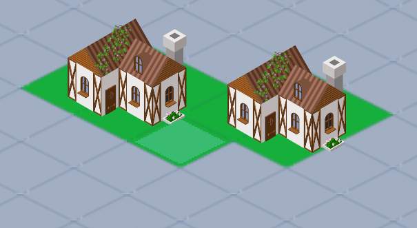
### During Placement
in here, we can move houses with input, mouse and by clicking space it place on grid.
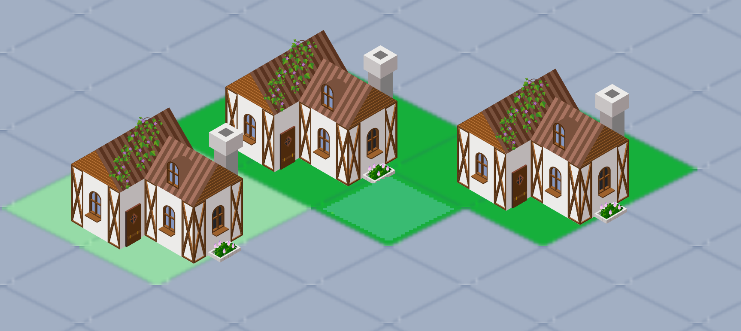
### Conflict Placement
in this picture, we can see that houses are placed on the same grid and it is not allowed.
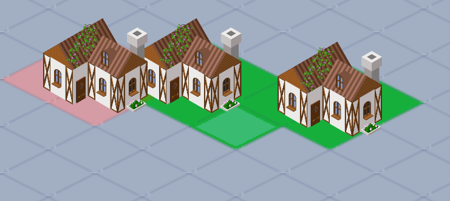
### Set and Open Timer
in this picture, we can see that timer is set and it is counting down.
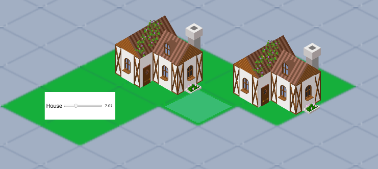
### Finish Placement
in this picture, we can see that timer is finished and houses are placed on the grid.
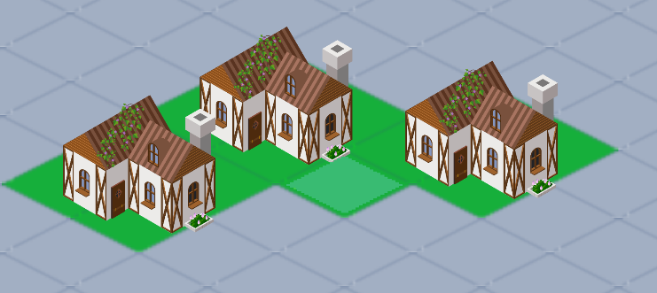

# ShopManager Class

## Overview

The `ShopManager` class is responsible for managing the shop in the game, 

## Dependencies
- `ShopSlotController`: managing shop slots, initializing and setting up items
- `ShopBuyController`: logic for the buying process, including purchasing items from the shop.
### Open Shop Panel And Check categories
in this picture, we can see that shop panel is opened and we can see the categories of items.
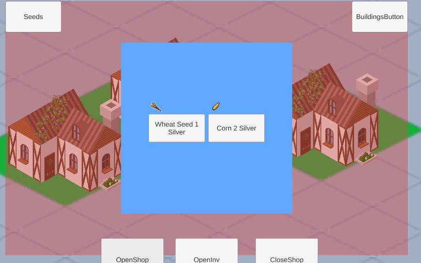
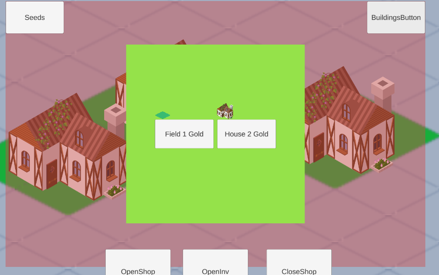
### Buy Items Before
check the money before buying items.
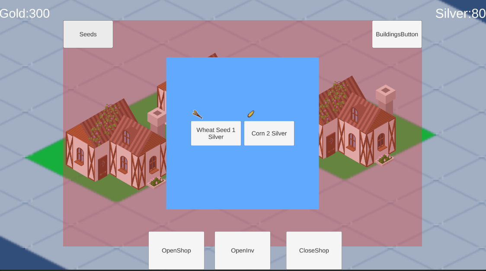
### Buy Items After
check the money after buying items.

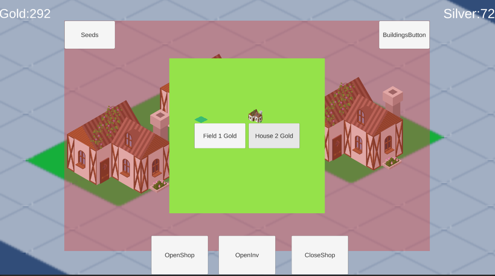

# InventoryManager Class

## Overview

The `InventoryManager` class is responsible for managing the player's inventory in the game.
It handles the interactions with inventory slots, currency updates, item usage, and item selling. 
## Dependencies

The class interacts with the following components:
- **InventorySlotsController**: Manages the slots in the inventory where items are stored.
- **InventoryCurrencyController**: Handles the currency system (e.g., gold, silver) and updates the currency UI.
- **InventoryItemController**: Manages the usage of items in the inventory.

# Slot Seeds
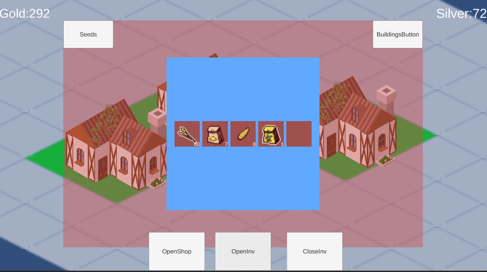
# Slot Buildings
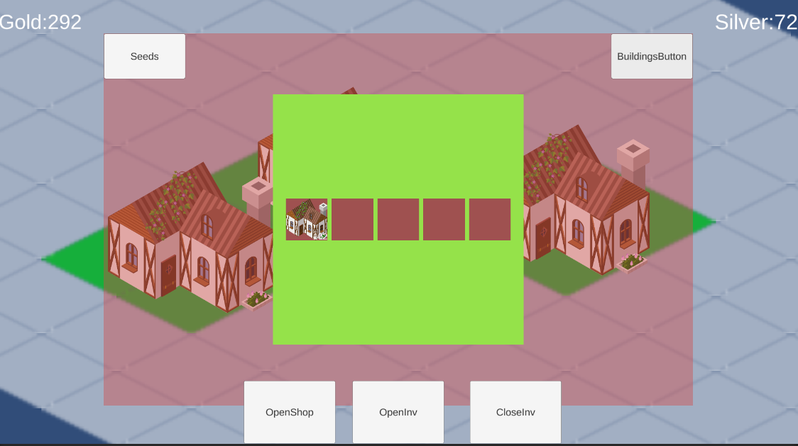
# Sell
you can sell item buy clicking on it and opens panel and press sell.
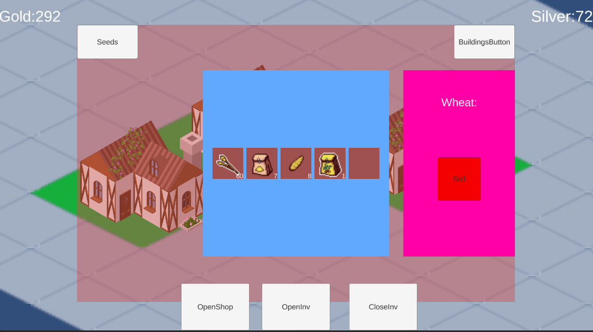
# After Sell
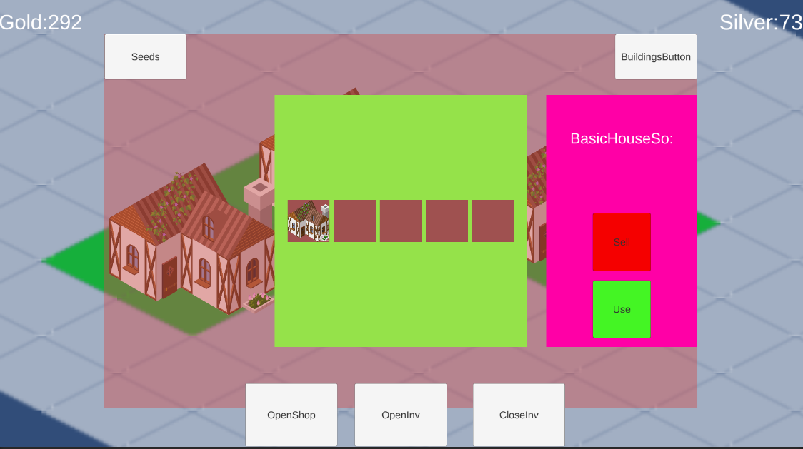

# Usage 
you can also use. 

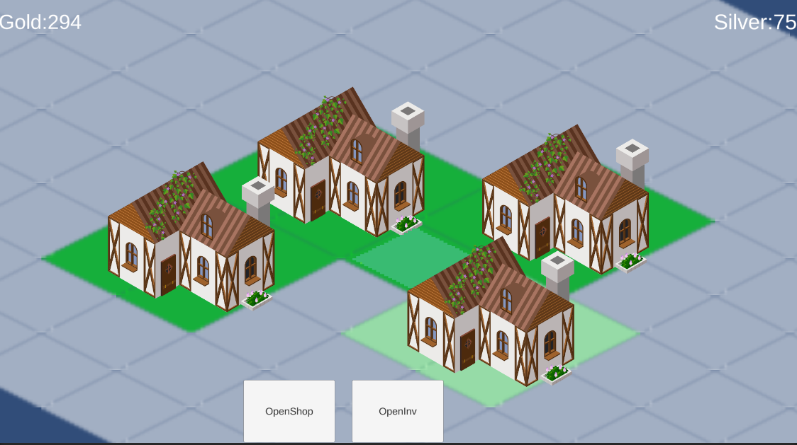

# Farming Class

# Clicking on house
you will see craft items and you can craft them by clicking on them.
it will reduce item from inventory and add new item to inventory.
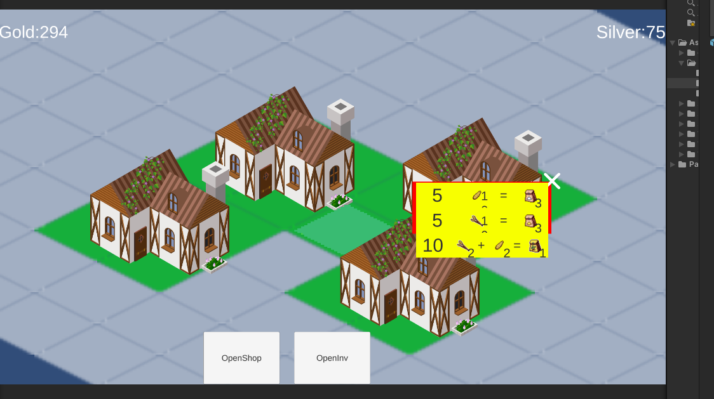
# Clicking on farm
you will see seeds and you can plant them by clicking on them.
remove seed from inventory and add new item to inventory.
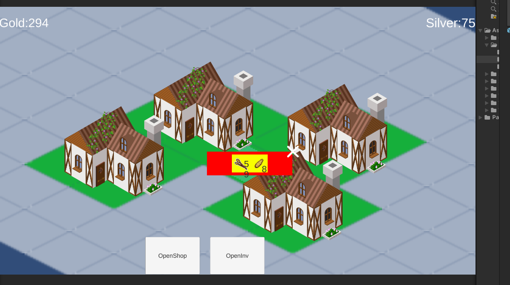
# After Click Farm
after click, there is popup timer. it will show you how much time left for harvesting.
it will still keep it after you close the game.
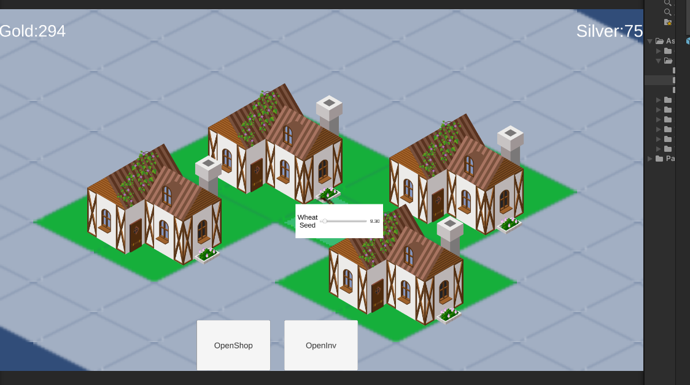
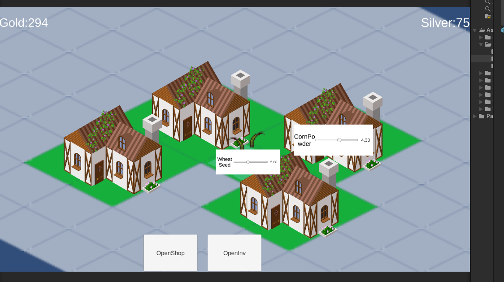
# Finish Time
after finish time, you can harvest it and it will add new item to inventory.
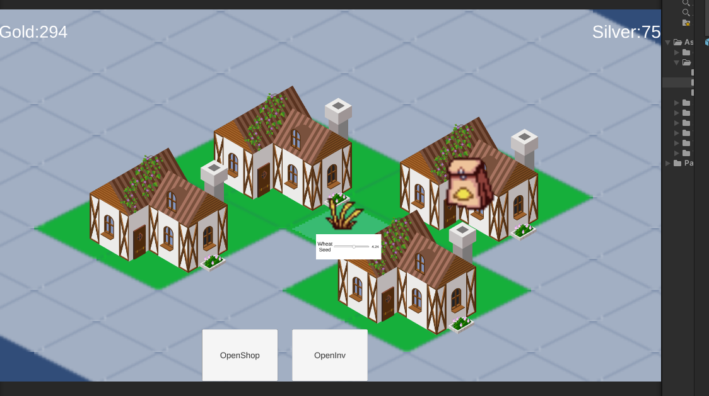
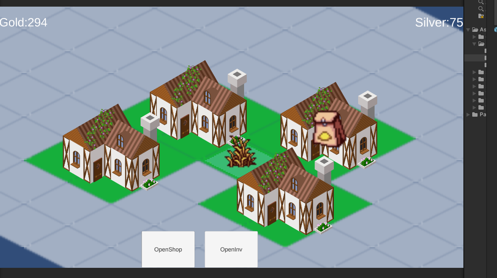
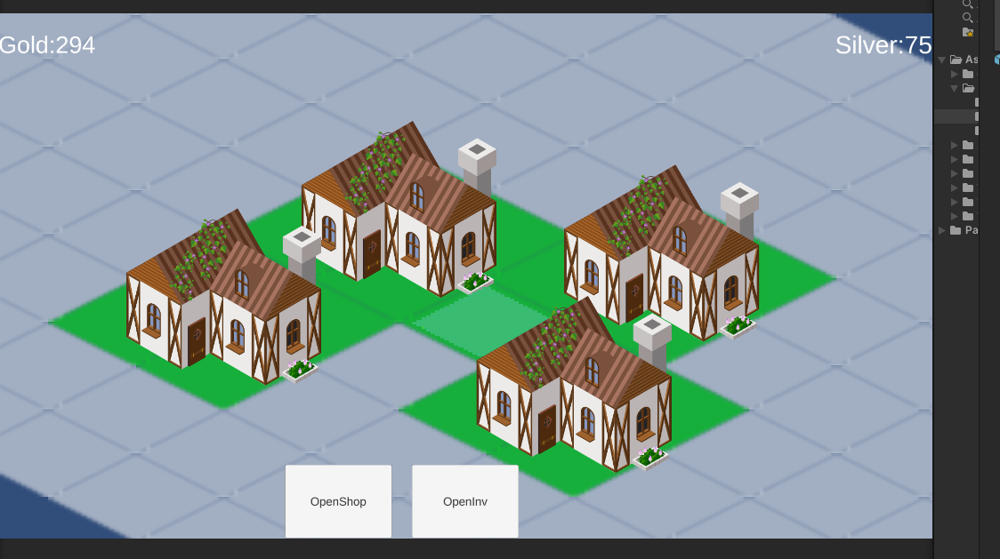

## Conclusion

This architecture is designed to create a modular game structure.

### Future Improvements
- Add event-based communication between managers.
- Optimize controller logic for better performance.
- Implement a dependency injection system to improve modularity.

---

✅ This project will not be updated in the future.

---

# License
Free to use for anything.
